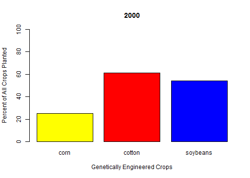
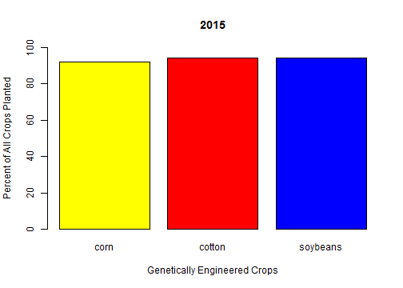

Adoption of Genetically Engineered Crops in U.S. from 2000-2015
========================================================
author: Developing Data Products Using Shiny
date: By Megan Longcor on August 22, 2015
width: 1000

Introduction
========================================================
type: sub-section

Genetically modified crops (GMCs) are becoming widely adopted in the United States despite their often controversial nature.

This report aims to illustrate the rapid rate of adoption of genetically engineered seeds by U.S. corn, cotton and soybean farmers since their commercial introduction.

The Shiny web application framework for R is used to turn this computational analysis into an interactive plot for visualization.

Data & Design
========================================================
type: sub-section

<small>Data for this project was obtained by USDA's National Agricultural Statistics Service (NASS) in the *June Agricultural Survey* for 2000 through 2015 (<a href="http://ers.usda.gov/data-products/adoption-of-genetically-engineered-crops-in-the-us.aspx" target="_blank">link</a>).</small>

<small>The data sets include statistics for insect-resistant, herbicide-tolerant and stacked gene (multiple traits) varieties of corn, upland cotton and soybeans in the United States.  Data pre-processing was required for this analysis (<a href="https://github.com/megdna/GeneticallyEngineeredCrops" target="_blank">code</a>).</small>

<small>The following slide shows output plots in R for input years 2000 and 2015, demonstrating the widespread adoption of genetically engineered crops in the U.S. during this period.</small>

Results & Conclusions
========================================================
type: sub-section

 
<small>In 2000, 25% corn, 61% cotton and 54% soybeans were genetically engineered in United States.</small>

***

 
<small>By 2015, over 90% of each crop planted in U.S. was genetically engineered (run app on next slide).</small>

Shiny Application
========================================================
title: false

<small>Note: if the Shiny application does not render properly, please view **<a href="https://megdna.shinyapps.io/GeneticallyEngineeredCrops" target="_blank">here</a>**.</small>

<iframe src="https://megdna.shinyapps.io/GeneticallyEngineeredCrops" height="600" width="100%"></iframe>
